Employee Management System

<p align="center">
  <strong>A web-based Employee Management System for managing employees, departments, users, authentication, and administrative operations.</strong>
</p>

<p align="center">
  
  
  
  
</p>

<p align="center">
  <a href="#screenshots">Screenshots</a> •
  <a href="#features">Features</a> •
  <a href="#technology-stack">Technology Stack</a> •
  <a href="#project-structure">Project Structure</a> •
  <a href="#api-documentation">API Documentation</a>
</p>

Screenshots

A visual overview of the application interface and its main workflows.

Authentication

<p align="center">
  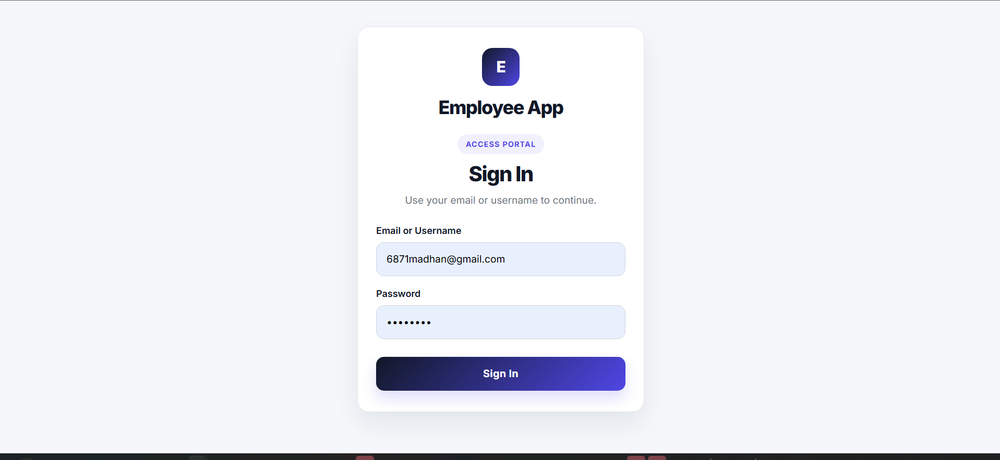
</p>

Employee Portal

<table>
<tr>
<td width="50%" align="center">
  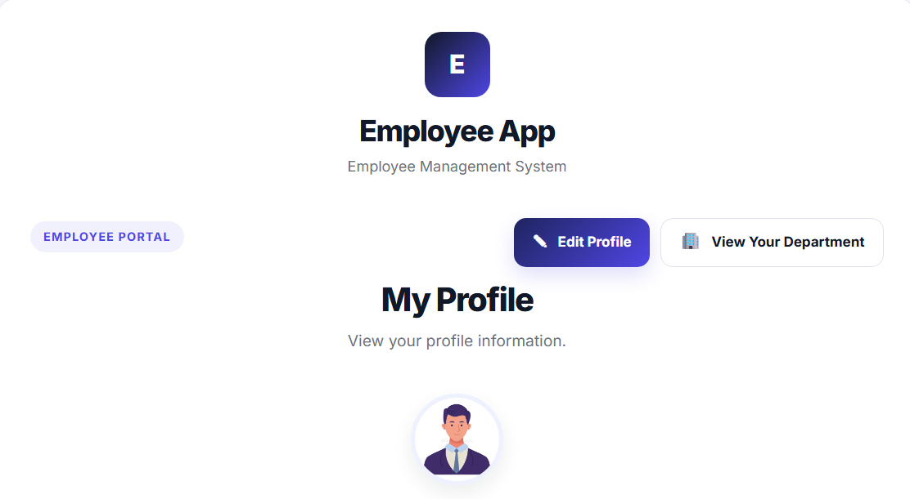
  <br><sub>Employee Profile</sub>
</td>
<td width="50%" align="center">
  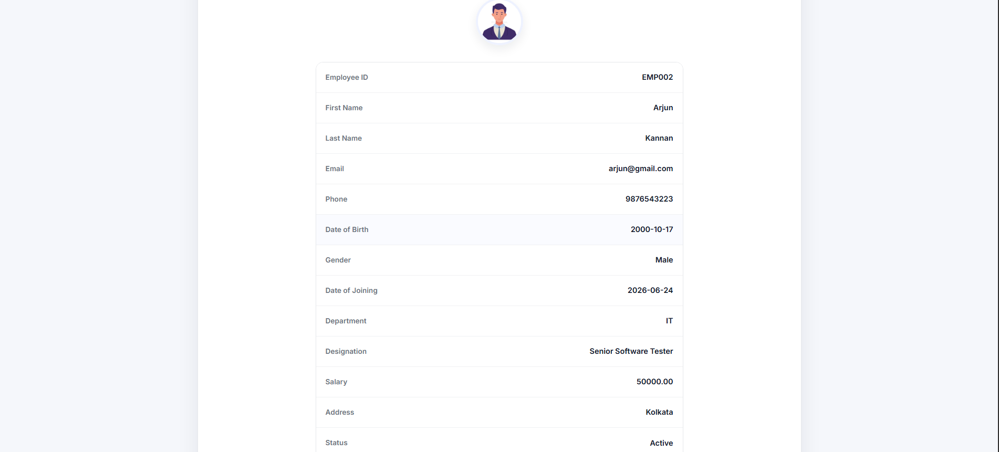
  <br><sub>Employee Details</sub>
</td>
</tr>
<tr>
<td width="50%" align="center">
  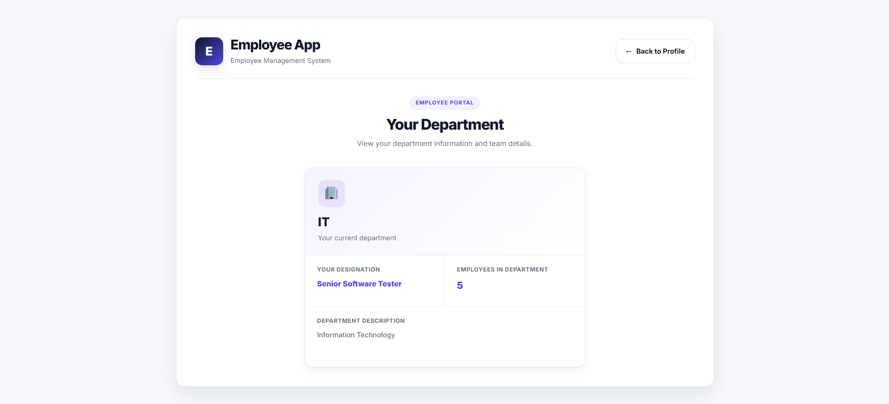
  <br><sub>Employee Department</sub>
</td>
<td width="50%" align="center">
  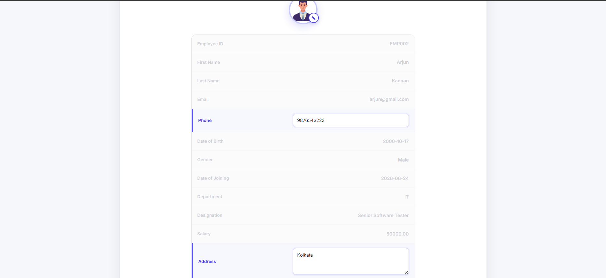
  <br><sub>Edit Employee</sub>
</td>
</tr>
</table>

<p align="center">
  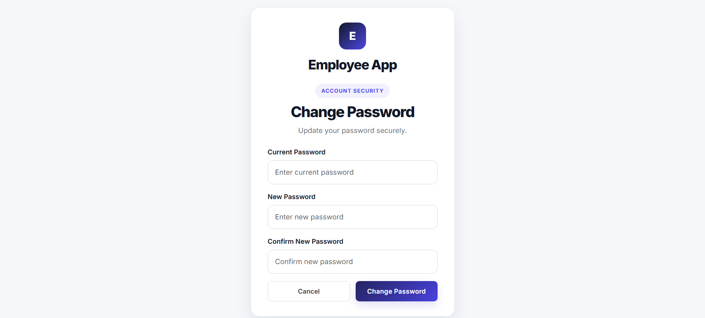
</p>

Employee Management

<p align="center">
  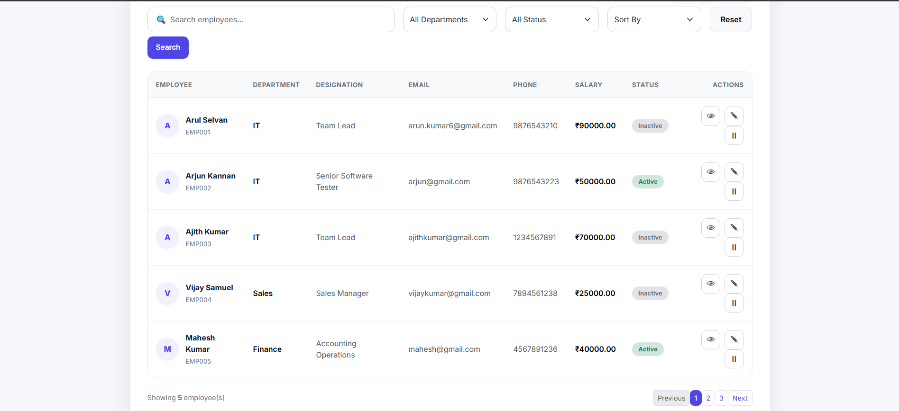
</p>

<table>
<tr>
<td width="50%" align="center">
  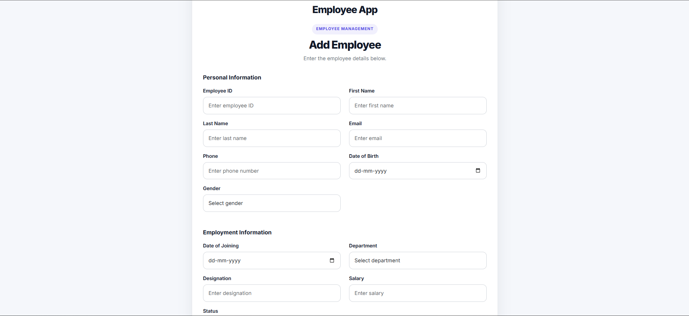
  <br><sub>Add Employee</sub>
</td>
<td width="50%" align="center">
  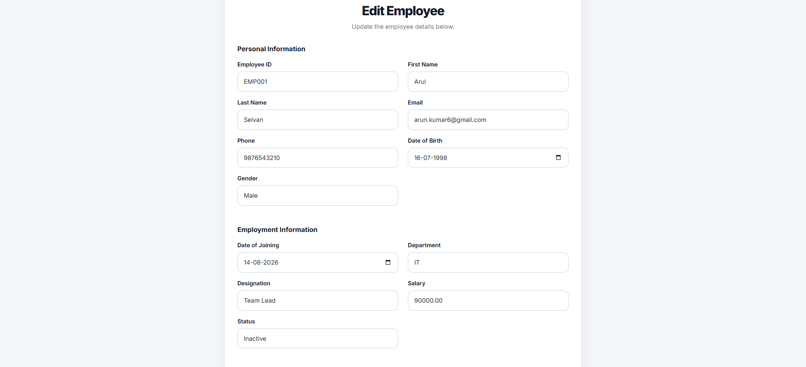
  <br><sub>Edit Employee</sub>
</td>
</tr>
<tr>
<td width="50%" align="center">
  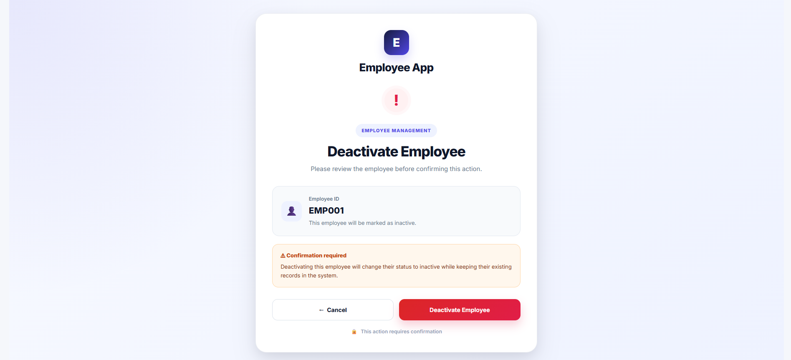
  <br><sub>Deactivate Employee</sub>
</td>
<td width="50%" align="center">
  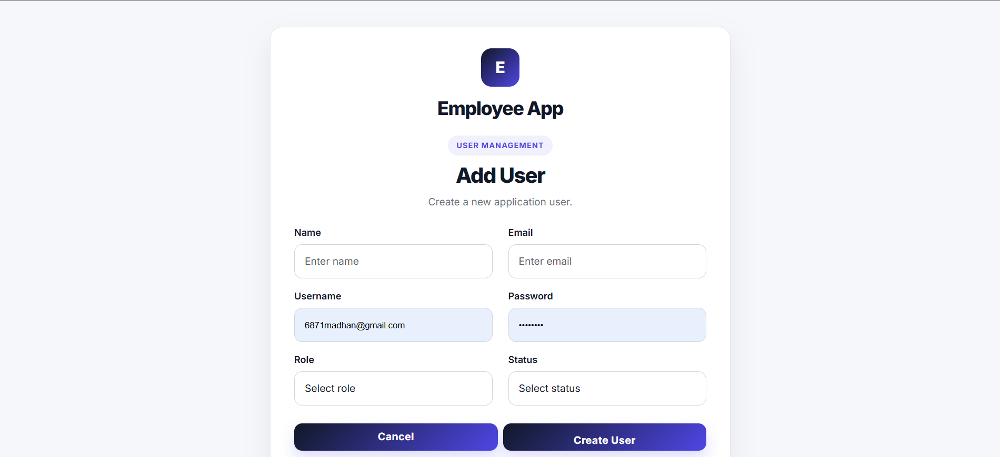
  <br><sub>Add User</sub>
</td>
</tr>
</table>

Admin Dashboard

<p align="center">
  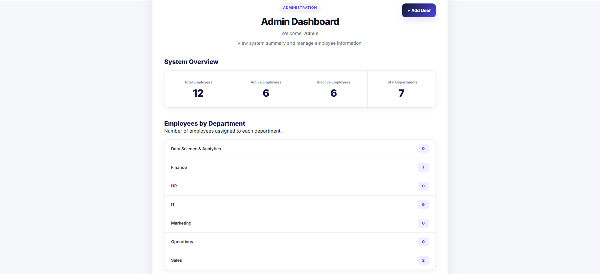
</p>

Department Management

<p align="center">
  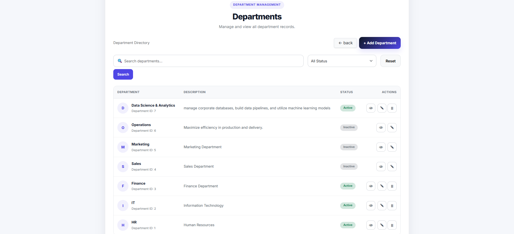
</p>

<table>
<tr>
<td width="50%" align="center">
  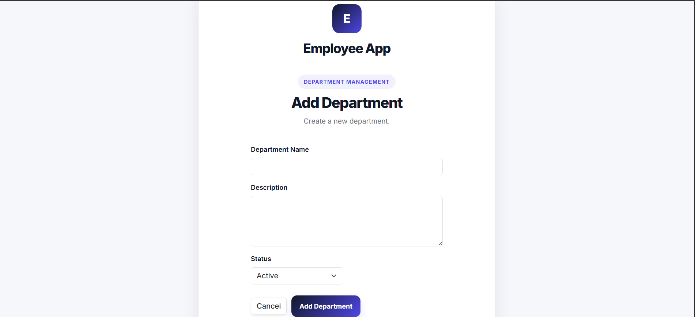
  <br><sub>Add Department</sub>
</td>
<td width="50%" align="center">
  
  <br><sub>View Department</sub>
</td>
</tr>
<tr>
<td width="50%" align="center">
  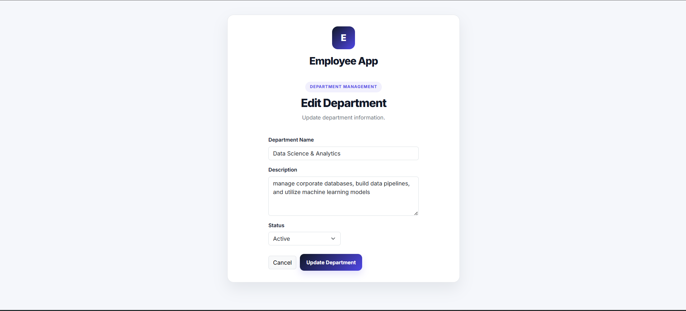
  <br><sub>Edit Department</sub>
</td>
<td width="50%" align="center">
  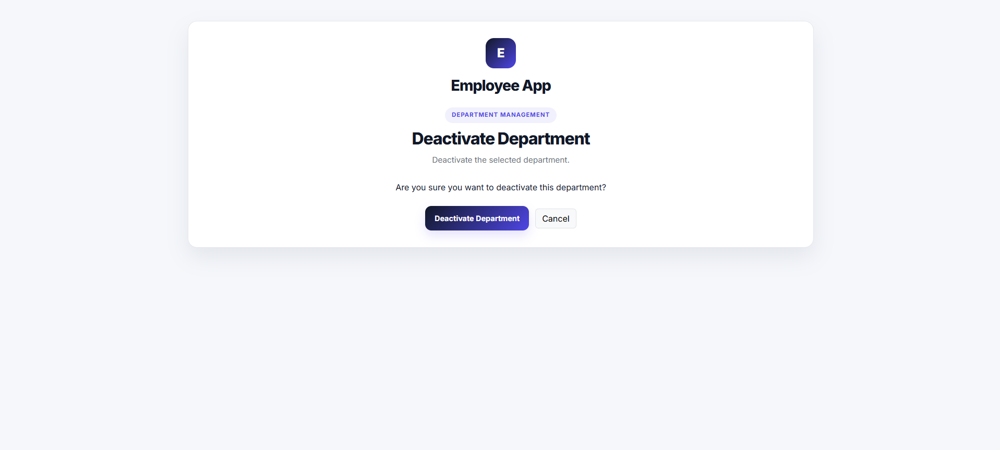
  <br><sub>Deactivate Department</sub>
</td>
</tr>
</table>

# Employee Management System

A web-based Employee Management System developed using PHP, MySQL, HTML, CSS, and JavaScript. The system provides role-based access for Admin and Employee users and includes employee, department, authentication, dashboard, validation, security, and REST API functionality.

---

## 1. Project Introduction

The Employee Management System is designed to manage employee and department information in an organization.

The system provides two main roles:

- Admin

- Employee

Admin users can manage employees and departments, while Employee users can access and update their own permitted profile information.

The project follows a simple MVC-based structure with separate Models, Views, Controllers, Services, Middleware, Routes, and public assets.

---

## 2. Features

### Authentication

- User login

- Session-based authentication

- Logout

- Change password

- Password hashing

- Authentication middleware

### Authorization

- Role-based access control

- Separate Admin and Employee access

- Protected Admin URLs

- Employees cannot access Admin management pages

- Custom 403 Access Forbidden page

### Admin Features

- Admin dashboard

- Employee management

- Department management

- User management

- Add employees

- View employees

- Edit employees

- Deactivate employees

- Search employees

- Filter employees

- Sort employees

- Pagination

- View department information

### Employee Features

- Employee login

- Employee profile

- View own profile

- Update permitted profile information

- Update profile photo

- View department information

- Change password

- Logout

### Department Management

- Add department

- View department

- Edit department

- Deactivate department

- Department status management

- Department and employee relationship

### Dashboard

The Admin dashboard provides:

- Employee statistics

- Department statistics

- Active employee count

- Inactive employee count

- Employee distribution by department

### REST API

Employee API functionality has been implemented for:

- Get all employees

- Get employee by ID

- Create employee

- Update employee

- Delete/deactivate employee

- JSON responses

- HTTP status codes

- API authentication and authorization

---

## 3. Technologies Used

- PHP

- MySQL

- HTML5

- CSS3

- JavaScript

- PDO

- Apache

- Git

- GitHub

---

## 4. Employee Management

The Employee Management module supports the following employee information:

- Employee ID

- First Name

- Last Name

- Email

- Phone

- Date of Birth

- Gender

- Date of Joining

- Department

- Designation

- Salary

- Address

- Profile Photo

- Status

- Created Date

- Updated Date

### Employee Operations

- Create employee

- View employee

- Update employee

- Deactivate employee

- Search employee

- Filter employee

- Sort employee

- Paginate employee records

---

## 5. Department Management

The Department module supports:

- Department creation

- Department viewing

- Department editing

- Department deactivation

- Department status management

The Employee and Department modules use a one-to-many relationship.

```text

Department

     |

     | 1

     |

     | Many

     ↓

Employee

One department can contain multiple employees.

6. User Management

The system supports user management with role-based access.

Available roles:

Admin

Employee

Passwords are securely hashed before being stored.

7. Database

MySQL is used as the database.

The main entities include:

users

employees

departments

The application uses relational database concepts including:

Primary keys

Foreign keys

Relationships

SELECT

INSERT

UPDATE

DELETE

WHERE

ORDER BY

JOIN

GROUP BY

Aggregate functions

PDO and prepared statements are used for database operations.

8. PHP Implementation

The project demonstrates practical PHP concepts including:

Variables

Conditions

Loops

Functions

Arrays

Strings

include

require

GET requests

POST requests

Forms

Sessions

File uploads

Validation

Error handling

9. Object-Oriented Programming

The project implements the following OOP concepts:

Classes

Examples include:

Employee

Department

User

EmployeeController

DepartmentController

PasswordService

AuthenticationService

Objects

Objects are created from classes to perform application operations.

Properties

Classes use properties to store object data and dependencies.

Methods

Business and application operations are implemented through class methods.

Constructors

Constructors are used to initialize objects and dependencies.

Encapsulation

Private and protected properties are used to control access to class data.

Inheritance

A reusable BaseController class is used by controllers where appropriate.

BaseController

      |

      ├── EmployeeController

      |

      └── DepartmentController

Interfaces

Interfaces have been implemented for service contracts:

EmployeeServiceInterface

PasswordServiceInterface

Traits

A reusable ValidationTrait has been implemented for common validation functionality.

Namespace

The Employee Service uses the App\Services namespace.

10. MVC Architecture

The project follows a simple MVC-based architecture.

Model

Models handle database operations and data access.

models/

├── Employee.php

├── Department.php

├── User.php

└── Dashboard.php

View

Views provide the user interface.

views/

├── auth/

├── admin/

└── employees/

Controller

Controllers handle application requests and coordinate models and services.

controllers/

├── BaseController.php

├── AuthController.php

├── EmployeeController.php

├── DepartmentController.php

├── UserController.php

└── DashboardController.php

Services

Business logic and validation are separated into service classes.

services/

├── AuthenticationService.php

├── EmployeeService.php

├── DepartmentService.php

├── DashboardService.php

└── PasswordService.php

11. Middleware

The project includes middleware for application security and access control.

AuthMiddleware

Checks whether the user is authenticated.

RoleMiddleware

Checks whether the authenticated user has the required role.

CsrfMiddleware

Protects state-changing requests from Cross-Site Request Forgery attacks.

12. Validation

Both client-side and server-side validation are implemented.

Client-Side Validation

JavaScript is used for validation such as:

Required fields

Email validation

Phone validation

File validation

Server-Side Validation

PHP validation includes:

Required field validation

Email validation

Duplicate employee validation

Employee ID validation

Phone validation

Date validation

Salary validation

Gender validation

Status validation

Profile update validation

File validation

Server-side validation is performed before database operations.

13. Security

The application includes several security measures.

Password Security

Passwords are hashed using PHP password hashing functionality.

SQL Injection Protection

PDO prepared statements are used for database queries.

Authentication

Session-based authentication protects restricted pages.

Authorization

Role-based authorization prevents Employee users from accessing Admin pages.

CSRF Protection

CSRF tokens are implemented for state-changing operations.

XSS Protection

User-controlled output is escaped using:

htmlspecialchars()

File Upload Security

Uploaded employee profile photos are validated before being stored.

14. REST API

The project includes an Employee REST API.

Available Operations

Method  Endpoint    Purpose

GET /employees  Get employees

GET /employees/{id} Get employee by ID

POST    /employees  Create employee

PUT /employees/{id} Update employee

DELETE  /employees/{id} Delete/deactivate employee

API responses are returned in JSON format.

HTTP status codes are used according to the result of the request.

15. Frontend Organization

JavaScript files are organized according to application modules.

public/js/

├── script.js

├── admin/

│   ├── admin-add user.js

│   └── dashboard.js

├── department/

│   ├── department-add.js

│   ├── department-deactivate.js

│   ├── department-edit.js

│   ├── department-view.js

│   └── department.js

└── employee/

    ├── deactivate.js

    ├── employee-add.js

    ├── employee-edit.js

    ├── employee-index.js

    ├── employee-profile.js

    └── employee-view.js

CSS files are also organized by module.

public/css/

├── style.css

├── admin/

│   ├── dashboard.css

│   └── dashboard-data.css

├── department/

│   ├── department.css

│   └── department-view.css

└── employee/

    ├── employee-deactivate.css

    └── employee-profile.css

16. Git Version Control

Git is used for version control and feature development.

The Employee Management work was developed using a feature branch:

employees-feature

A meaningful commit was created for the employee management implementation.

The feature branch has been pushed to GitHub and prepared for Pull Request review.

17. Current Project Status

Completed

Authentication

Session management

Role-based authorization

Admin access protection

Employee management

Employee CRUD operations

Employee search

Employee filtering

Employee sorting

Employee pagination

Employee profile

Profile photo upload

Department management

Department and employee relationship

User management

Dashboard

Password hashing

PDO database access

Prepared statements

Client-side validation

Server-side validation

CSRF protection

XSS protection

Secure file upload handling

MVC structure

OOP implementation

Classes and objects

Properties and methods

Constructors

Encapsulation

Inheritance

Interfaces

Traits

Namespace

REST API

JavaScript organization

CSS organization

Git feature branch

GitHub push

Pull Request preparation

Pending

The following project requirements are still to be completed:

Minimum 30 test cases

Documentation of at least 5 bugs and fixes

Final API documentation

Final README updates

Jira / Agile documentation and screenshots

Final database SQL audit

Final screenshots

Final presentation/demo preparation

Code review and approved PR merge

18. Future Enhancements

Possible future enhancements include:

Email notifications

Employee attendance

Leave management

Payroll management

Advanced reports

PDF/Excel report export

Audit logs

Password reset through email

Two-factor authentication

Advanced role and permission management

Automated testing

Cloud deployment

Author

Madhan M

Employee Management System